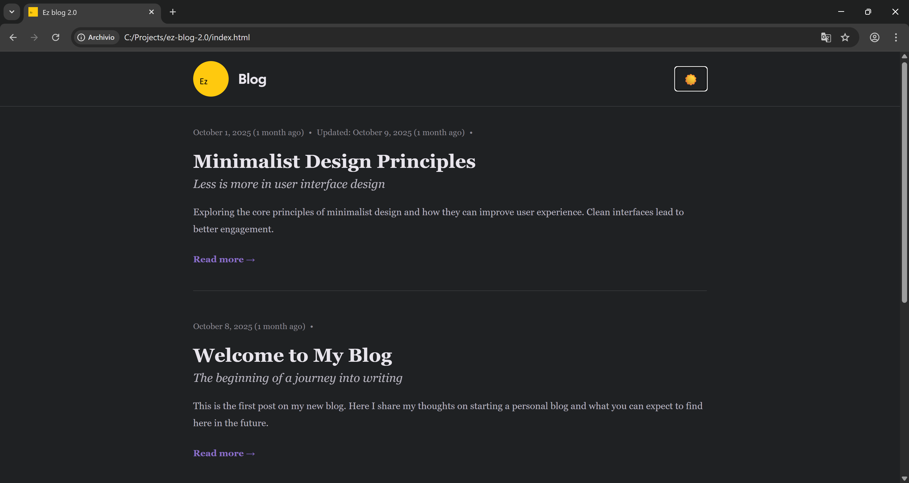
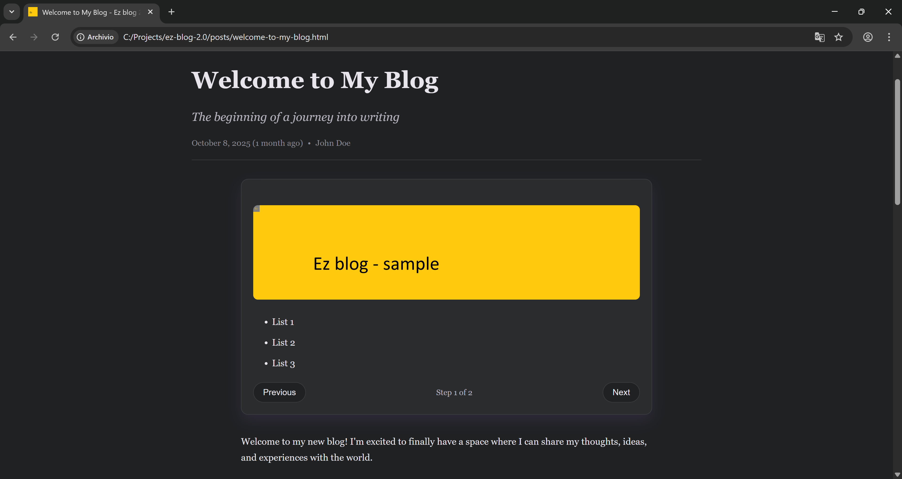

# EZ Blog 2.0

A lightweight (~1.7Mb), simple, static blog generator that transforms markdown-like HTML posts into a fully static website. Perfect for GitHub Pages deployment.

## Preview

*Screenshot showing the blog's clean design with light/dark theme support*

## About This Project

This repository is an improved version of [ez-blog](https://github.com/borgoo/ez-blog), the original dynamic blog implementation. EZ Blog 2.0 brings several key improvements:

- **Dynamic to Static**: Transformed from a dynamic blog (requiring JavaScript to load posts) to a fully static site generator. All posts are pre-rendered as complete HTML pages during the build process, resulting in faster load times and better SEO.

- **GitHub Pages Optimized**: Better compliance with GitHub Pages hosting. The static generation approach eliminates client-side routing issues and ensures all content is immediately available to search engines and social media crawlers.

- **Enhanced Social Sharing**: Improved meta tags (Open Graph, Twitter Cards) for better post sharing on platforms like LinkedIn, Twitter, Facebook, and other social networks. Each post page includes proper metadata for rich link previews.

- **Build System**: Introduced a Node.js-based build system that automates the generation of static pages, robots.txt, and sitemap.xml, making the workflow more maintainable and scalable.

## Features

- **Fully Static**: Generates complete HTML pages with no server-side dependencies
- **Incremental Build**: Only regenerates new or modified posts, making builds faster
- **Simple Workflow**: Write posts in HTML, run build, deploy
- **Customizable**: All configuration in `build.config.json`
- **SEO Ready**: Auto-generates `robots.txt` and `sitemap.xml`
- **Scheduled Posts**: Posts with future dates are automatically filtered out

## Quick Start

### 1. Initialize Configuration

Edit `build.config.json` to customize your blog:

```json
{
  "blog": {
    "title": "Your Blog Title",
    "description": "Your blog description",
    "baseUrl": "https://yourusername.github.io/blog/",
    "author": {
      "name": "Your Name",
      "email": "your.email@example.com",
      "website": "https://yourwebsite.com",
      "github": "https://github.com/yourusername",
      "linkedin": "https://linkedin.com/in/yourprofile"
    }
  },
  "meta": {
    "title": "Your Blog Title",
    "description": "Your blog description",
    "canonical": "https://yourusername.github.io/blog/",
    // ... update all meta tags with your information
  }
}
```

**Important**: Update all URLs, author information, and meta tags in `build.config.json` to match your blog.

### 2. Writing a New Post

#### Step 1: Create the Post HTML File

Create a new HTML file in the `buildable-drafts/` directory. Use a URL-friendly name (e.g., `my-awesome-post.html`):

```html
<h2>Introduction</h2>

<p>Your opening paragraph goes here. This should hook the reader and introduce your topic.</p>

<h2>Main Section</h2>

<p>Content for your main section. Each paragraph should focus on a single idea.</p>

<h3>Subsection</h3>

<p>If you need to break down a section further, use h3 tags for subsections.</p>

<h2>Conclusion</h2>

<p>Wrap up your thoughts here.</p>
```

**Content Guidelines:**
- Use semantic HTML tags (`<p>`, `<h2>`, `<h3>`, `<ul>`, `<ol>`, `<blockquote>`, etc.)
- `h1` is reserved for the title (added automatically), start with `h2` for sections
- Keep paragraphs concise for better readability
- Use lists for easier scanning
- Add blockquotes for emphasis or quotes

#### Step 2: Add Images (Optional)

If your post includes images:

1. Create a folder in `buildable-drafts/assets/` with the same name as your post ID (e.g., `buildable-drafts/assets/my-awesome-post/`)
2. Place your images in that folder (you can organize them in subfolders like `images/` if needed)
3. Reference them in your HTML: `` or `` if you use a subfolder

**Note**: The entire folder structure from `buildable-drafts/assets/{post-id}/` will be copied to `posts/assets/{post-id}/` during the build process, maintaining the same structure.

#### Step 2.1: Using Image Slider (Optional)

If you want to display multiple images in a slider format, you can use the built-in simple slider component:

1. Place your images in the post's assets folder (same as Step 2)
2. Use the slider HTML structure in your post content:

```html
<div class="simple-slider" data-simple-slider>
  <div data-simple-slider-slide>
    
    <ul>
      <li>List 1</li>
      <li>List 2</li>
      <li>List 3</li>
    </ul>
  </div>
  <div data-simple-slider-slide>
    
  </div>
  <div data-simple-slider-slide>
    
  </div>
</div>
```
**Note**: The slider is automatically initialized when the page loads. No additional JavaScript is required.

##### Preview



#### Step 3: Add Post Metadata

Edit `buildable-drafts/data/DB_posts.js` and add your post metadata:

```javascript
[
  // ... existing posts
  {
    "id": "my-awesome-post",                    // Must match filename without .html
    "contentFile": "my-awesome-post.html",      // Path to your HTML file
    "title": "My Awesome Post",                 // Main title
    "subtitle": "A subtitle that adds context", // Subtitle
    "abstract": "A brief summary that appears on the homepage preview.",
    "author": "Your Name",                      // Author name
    "authorNickname": "@yourusername",          // Author nickname (optional)
    "createdDate": "2025-01-15",               // Format: YYYY-MM-DD
    "updatedDate": "2025-01-15",               // Format: YYYY-MM-DD
    "language": "en"                            // Language code
  }
]
```

**Important Notes:**
- The `id` should be URL-friendly (lowercase, hyphens instead of spaces)
- The `id` must match the filename (without `.html`)
- Posts with `createdDate` in the future will not be published until that date
- Posts are automatically sorted by `updatedDate` (or `createdDate`) in descending order

### 3. Building Your Blog

#### Incremental Build (Default)

By default, the build process is incremental and only regenerates posts that are:
- **New**: No timestamp registered for the post ID
- **Modified**: The `updatedDate` in `DB_posts.js` is newer than the last build timestamp, OR the content file was modified after the last build

Generate static pages (only new/modified posts will be regenerated):

```bash
node build.js
```

This will:
- Copy assets from `buildable-drafts/assets/` to `posts/assets/` (maintaining the same folder structure)
- Copy data from `buildable-drafts/data/` to `posts/data/`
- Generate only new or modified post pages in `posts/`
- If any posts were generated, automatically regenerate `index.html`, `robots.txt`, and `sitemap.xml`

**Note**: The build system tracks generation timestamps in `.build-timestamps.json` to determine which posts need regeneration.

#### Force Index Generation

Force generation of `index.html` even if no posts were modified:

```bash
node build.js --index-only
# or
node build.js -i
```

#### Force Generation of Specific Post

Force regeneration of a specific post by ID (useful for testing or fixing issues):

```bash
node build.js --id post-id-here
# or
node build.js -id post-id-here
```

This will:
- Regenerate the specified post
- Automatically regenerate `index.html`, `robots.txt`, and `sitemap.xml`

#### Remove Specific Post

Remove a specific post and its associated files:

```bash
node build.js --remove post-id-here
# or
node build.js -r post-id-here
```

This will:
- Remove the post HTML file (`posts/{post-id}.html`)
- Remove the post's assets directory (`posts/assets/{post-id}/`)
- Remove the post from build timestamps tracking

#### Clean All Generated Files

Remove all generated files (index.html, posts/, robots.txt, sitemap.xml, and build timestamps):

```bash
node build.js --remove-all
# or
node build.js -ra
```

**Note**: This does NOT remove `./assets/` in the root directory, as it may contain other assets.

## Project Structure

```
ez-blog-2.0/
├── buildable-drafts/          # Your source files (posts, assets, data)
│   ├── assets/                # Post-specific images
│   │   └── {post-id}/         # Images for each post
│   ├── data/
│   │   └── DB_posts.js        # Post metadata
│   └── *.html                 # Post content files
├── posts/                     # Generated static pages (created by build)
│   ├── assets/
│   │   └── {post-id}/         # Copied images (same structure as buildable-drafts)
│   ├── data/
│   │   └── DB_posts.js        # Copied metadata
│   └── *.html                 # Generated post pages
├── build.js                   # Main build script (with incremental build)
├── build.config.json          # Blog configuration
├── .build-timestamps.json     # Build timestamps tracking (auto-generated)
└── index.html                 # Generated homepage
```

## Managing buildable-drafts

The `buildable-drafts/` directory contains your draft posts, assets, and metadata. This directory is excluded from version control via `.gitignore` to keep your drafts private and separate from the public blog repository.

### Recommended Workflow

1. **Separate Repository for Drafts**: Create a separate private Git repository for your `buildable-drafts/` directory. This allows you to:
   - Keep your drafts private
   - Version control your work-in-progress posts
   - Maintain a backup of your content
   - Work on drafts independently from the blog structure

2. **Blog Repository Structure**: The main blog repository (this one) should only contain:
   - The blog structure and configuration files
   - Generated static pages (after running `build.js`)
   - Build scripts and utilities
   - **NOT** the `buildable-drafts/` directory

3. **Typical Workflow**:
   - Write and edit posts in your private `buildable-drafts/` repository
   - Commit and push your drafts to that private repository
   - Run `node build.js` in the blog repository to generate static pages
   - Commit and push only the generated files (index.html, posts/, robots.txt, sitemap.xml) to the public blog repository

This separation ensures that:
- Your drafts remain private
- The public blog repository only contains published content
- You can work on drafts without affecting the public blog
- The blog repository stays clean and focused on the generated static site

## Deployment

### GitHub Pages

1. Push your repository to GitHub
2. Go to repository Settings → Pages
3. Select the branch and folder (usually `main` and `/ (root)`)
4. Your blog will be available at `https://yourusername.github.io/repository-name/`

**Important**: Make sure to update `baseUrl` in `build.config.json` to match your GitHub Pages URL.

## Workflow Example

1. **Write a new post**: Create `buildable-drafts/my-post.html` and add metadata to `DB_posts.js`
2. **Add images** (optional): Place them in `buildable-drafts/assets/my-post/`
3. **Build**: Run `node build.js`
4. **Test locally**: Open `index.html` in a browser (use a local server for ES modules)
5. **Deploy**: Commit and push to GitHub

## Tips

- Use future dates in `createdDate` to schedule posts (they won't appear until that date)
- Update `updatedDate` in `DB_posts.js` when you modify a post to ensure it gets regenerated and stays at the top of the list
- The incremental build system automatically detects file modifications, but updating `updatedDate` ensures proper tracking
- Keep post IDs URL-friendly (lowercase, hyphens, no spaces)
- Test your build locally before deploying
- Use `node build.js --remove-all` to start fresh if something goes wrong
- The `.build-timestamps.json` file tracks when each post was last generated - you can safely delete it to force a full rebuild

## Requirements

- Node.js (for running the build scripts)
- Modern browser (for viewing the generated site)
